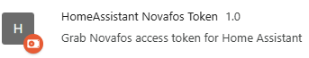

# Chrome extension: ha-novafos-token



**Security notice: Please do yourself a favor and make a habit of checking that extensions don't transmit your personal info to the Internet.  This extension reads headers of your browser traffic and extracts the authentication token allowing a web application, like the official webpage application to retrieve your data from the KMD data storage.  The Bearer token extracted is only valid for 60 minutes but this is enough for anyone to grab your personal data.**

The extension will only transmit the token to the server you specify, and only over HTTPS. The source code is open for inspection/verification, do youself a favor and take a look to see how it does it.

With that out of the way...

## 🚀 What does this do?

Retrieve a Bearer token from Novafos website and inject into Home Assistant using a service action call.

When logging into Novafos using either email/password or MitID, this extension will inspect headers from network traffic and present the user with a button to send it to Home Assistant.

## 🔑 Key Features
- Enables much easier update of Novafos water/heating use data in Home Assistant.
- Enables extraction of Bearer tokens in general, though function is specialised for Home Assistant and the Novafos module.

## 🌐 Browser support
Available for Chrome, maybe Firefox, Edge, Chromium.  I don't know.

## 🎯 How to Use

### Daily use
1. Go to novafos.dk, and login as you would normally using user/pass or MitID. I strongly recommend using a password manager like Bitwarden/Vaultwarden.
2. The extension will show a little "OK" badge when a token is detected.
3. Click the extension icon to open the popup
4. Click the "Send token to home assistant" button.
5. Data in Home Assistant should now update directly.

## 🎯 How to Install

### Requirements

- Chrome or extension compatible browser.
- Access to Home Assistant via HTTPS.  If you don't know how to serve HA through HTTPS, see below for a Traefik setup or look for help on the forums.

### Home Assistant first time setup
1. Make sure your Home Assistant is using HTTPS.  This is important because
   calling a HTTP (unsecure) site from a secure page is not allowed, nor advisable.
   You can configure caddy, nginx, Traefik, Tailscale, maybe even Home Assistant itself to use SSL/HTTPS.
2. If you setup a HTTPS proxy like Traefik, you want to put this into the http-section in `configuration.yaml`:
```
    http:
        use_x_forwarded_for: true
        trusted_proxies:
            - <your-proxy-IP>
```
3. Restart Home Assistant

#### If you face trouble with CORS

If you for some reason get CORS erors, you may need to add permission for the extension to do what it does. Try this:

1. Open your `configuration.yaml` file.
2. Add a section like this to allow the extension to call the HA REST API.
```
    http:
        cors_allowed_origins:
            - chrome-extension://ghmhahihkmbifnlhcjfldfjlmmcjppko
            - https://minforsyning-2.kmd.dk
```

### Chrome installation first time use

1. Download the files for the extension
2. In chrome go to [Chrome extensions](chrome://extensions/)
3. Enable "developer mode"
4. Click "load unpacked"/"indlæs upakket" and browser to the directory `ha-novafos-token`.  Press the okay button.
5. The extension should be added to Chrome now.
6. Click the little 'puzzle piece' and pin the extension.

Will I publish the extension on the Chrome store? No. The scope for this is so limited it is for the enthusiast user.

### First time configuration

1. Click the extension and a small popup window will appear.
2. Enter your Home Assistant HTTPS URL (no trailing /, please): ```https://homeassist.my.home```
3. Enter your Home Assistant long lived access token: ```eyJhbGciOiJIU....```
4. Click the "Check this box ...".

If you have a test instance (or just another instance) of Home Assistant, you can click the development mode button and fill out a
second set of fields.  As long as this box is checked service calls will go to this other instance.

---

# Using Traefik-proxy to get Home Assistant on HTTPS

If you are unsure how to serve Home Assistant via HTTPS (which is a requirement for the Chrome extension), you can find an example here using Traefik as a docker-compose file and static setup.
There are several other ways to do this of course.

In the `traefik-proxy` directory you will find a docker-compose file and static setup for proxying Home Assistant.  Try it out.  Then read about Traefik and never ever expose your Home Assistant directly to the Internet.  Use Tailscale or NabuCasa for this.

Alternatives are Apache, Nginx, Caddy, Traefik, NabuCasa.
There is a thread here which may help too: [https://community.home-assistant.io/t/connecting-to-ha-locally-using-https/566441/50](https://community.home-assistant.io/t/connecting-to-ha-locally-using-https/566441/50)

Note: Only the Traefik setup is tested as part of the development of this extension.
